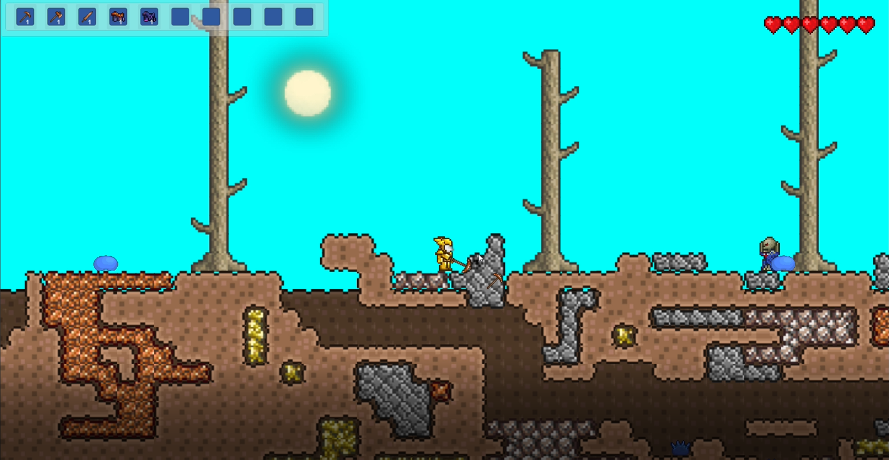
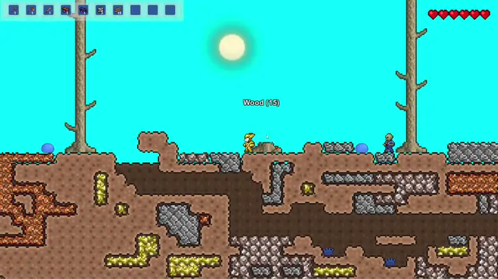
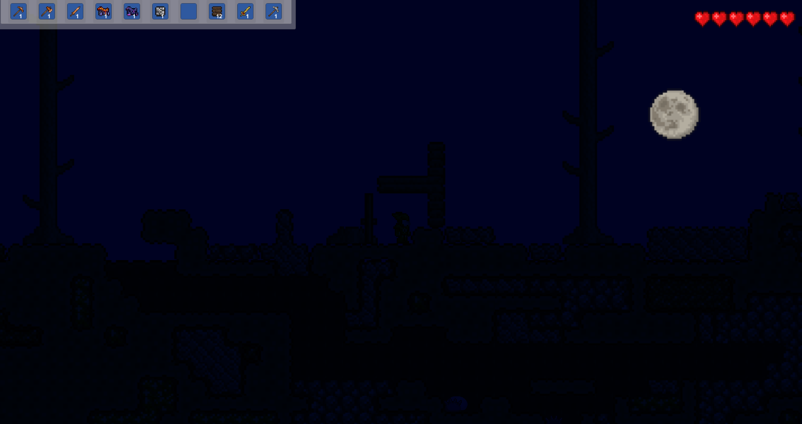

<h1 align="center">⛏️ Terraria Systems Replica</h1>

  

  <strong>A systems-focused Unity recreation of Terraria's core sandbox loop.</strong> 
  Mine and place tiles, fight enemies, collect resources, craft equipment, and prepare for the dangers of night.

  
  
  
  
  

  <a href="https://drive.google.com/file/d/1hQqMkyFQBbslZfW9jQHp3CYebAsEG_qH/view"><strong>Watch Gameplay (1:32)</strong></a>
  ·
  <strong>Windows Build — coming soon</strong>

  

Inventory, hotbar, crafting, and equipment systems working together at runtime.

## 📌 Project Snapshot

| | |
|---|---|
| **Role** | Gameplay Programmer |
| **Engine** | Unity 2019.2.0f1 |
| **Language** | C# |
| **Team** | 3 programmers |
| **Development** | October–December 2019 · approximately 7 weeks |
| **Platform** | Windows PC |
| **Status** | Completed academic assignment; archived portfolio copy |

## 🎮 Overview

This project recreates a compact selection of *Terraria*-inspired sandbox systems: a destructible tilemap world, collectible resources, item placement, combat, enemies, crafting, equipment, and a day/night cycle. It was developed as a three-programmer academic assignment with an emphasis on coordinating several data-driven gameplay systems inside one playable loop.

My primary responsibility was the item-facing architecture: inventory and hotbar behaviour, item data, crafting recipes and resource consumption, equipment slots, and the UI and input flows connecting those systems to the player.

## 🕹️ How to Play

Explore the map, gather materials, craft stronger items, equip armour, and fight enemies while modifying the tile-based world.

| Input | Action |
|---|---|
| `A` / `D` or Left / Right Arrow | Move |
| `Space` | Jump |
| Left Mouse Button | Use the equipped item |
| Right Mouse Button | Interact or perform the contextual action |
| `1`–`0` | Select a hotbar slot |
| `Escape` | Open or close inventory, crafting, and equipment UI |
| Mouse Wheel | Scroll through the crafting list |

## 👨‍💻 My Contributions

I worked as one of three programmers. My contribution focused on the architecture and runtime behaviour of the inventory, item, crafting, equipment, UI, and input systems:

- Designed and implemented a dynamic **inventory and hotbar system**, including pooled slots, item stacking, selection, swapping, quantities, and configurable starting items.
- Built the **item data architecture** around ScriptableObjects, item collections, lists, database lookup, quantities, descriptions, armour data, and runtime item handlers.
- Implemented the **crafting pipeline**, including recipe definitions, availability checks, material requirements, resource consumption, crafted-item insertion, and automatic UI refresh.
- Developed the **crafting interface and scrolling flow**, connecting recipe state to the player's current inventory.
- Implemented **equipment and armour slots** with item validation, slot swapping, and event-driven equip and unequip behaviour.
- Created the main **UI management flow** for inventory, crafting, equipment panels, contextual descriptions, and player-facing messages.
- Implemented hotbar selection through number keys and integrated item actions with player input and the in-hand item component.
- Connected these systems to the team's reusable object-pooling and event infrastructure.

The repository preserves the original team development history and authorship. I present the project as collaborative work and do not claim sole authorship of the complete game.

## ⚙️ Technical Highlights

### Inventory and hotbar

Inventory slots are created and reused through pooling rather than being hard-coded into the interface. Items can be stacked, moved between slots, selected from the hotbar, and exchanged with equipment slots while preserving quantity and item-state rules.

### Data-driven item architecture

ScriptableObject-based item definitions separate authoring data from runtime behaviour. Collections, databases, recipes, armour definitions, and quantity structures provide a common vocabulary for inventory, crafting, equipment, pickups, and player actions.

### Crafting dependency flow

Crafting recipes describe their required resources and output. The runtime evaluates recipe availability against inventory contents, consumes the correct quantities, adds the result, and refreshes the crafting interface whenever relevant state changes.

### Equipment, UI, and events

Equipment slots validate compatible armour types and coordinate swapping through shared item abstractions. UI panels and descriptions react to inventory and equipment changes through the project's event flow, keeping presentation separate from most item logic.

## ✨ Team Project Features

- Destructible and placeable tilemap terrain.
- Resource collection, item drops, tools, weapons, and armour.
- Inventory, hotbar, crafting, and equipment progression.
- Player movement, jumping, health, damage, death, and respawn.
- Melee combat and ground-based enemy behaviours.
- Day/night cycle with 2D lighting changes.
- Trees, environmental resources, and a layered underground world.
- HUD, health bars, item descriptions, and contextual messages.

The original assignment targeted additional flying enemy variants; the final project debrief records those as the main feature not completed during the production window.

## 🛠️ Technology

- Unity 2019.2.0f1
- C#
- Unity Tilemaps and 2D Extras
- ScriptableObjects
- UGUI
- Lightweight Render Pipeline and 2D lighting
- Event-driven input and gameplay communication
- Object-pooling integration

## 🎬 Media

- [Gameplay capture — inventory, crafting, equipment, combat, and world interaction (1:32)](https://drive.google.com/file/d/1hQqMkyFQBbslZfW9jQHp3CYebAsEG_qH/view)
- [Extended gameplay capture (2:05)](https://drive.google.com/file/d/1SIichOb299btG9pG4cApRij7s9YE8oWD/view)

  

The same sandbox transitions into a darker night state through the project's time and lighting systems.

## 🚀 Build and Running the Project

### Windows build

A preserved Windows build has been located and is being verified before publication as a GitHub Release.

### Unity project

1. Install Unity **2019.2.0f1** through Unity Hub.
2. Clone this repository.
3. Open the repository root as a Unity project.
4. Allow Unity to restore the packages recorded in `Packages/manifest.json`.
5. Open `Assets/Scenes/SampleScene.unity` and enter Play Mode, or create a Windows build using the configured scenes.

Generated Unity folders, IDE caches, logs, and the old packaged build were removed from Git history. The source project and its original **236-commit** development history, authors, dates, and messages are preserved; playable builds are archived separately through GitHub Releases.

## 🧭 Project Context

- **Context:** Academic programming assignment
- **Team:** Christopher Bonetto, Michelangelo Borsarelli, and Alessandro Pantano
- **My position:** One of three programmers; primary focus on inventory, item, crafting, equipment, and related UI/input systems
- **Repository history:** Original collaborative history preserved; later portfolio-migration changes identified separately

## 👥 Credits, Ownership and Status

This is an educational systems recreation inspired by *Terraria*. *Terraria* and its trademarks belong to Re-Logic; third-party tools and assets remain the property of their respective owners.

> This repository is shared for portfolio review and archival purposes. It documents my contribution to a collaborative student project and does not grant permission to reuse third-party or team-owned assets. It is not an open-source release.

**Project status:** Completed academic assignment; no longer actively maintained.

## 💼 Contact

[LinkedIn — Christopher Bonetto](https://www.linkedin.com/in/christopher-bonetto-547876221)
